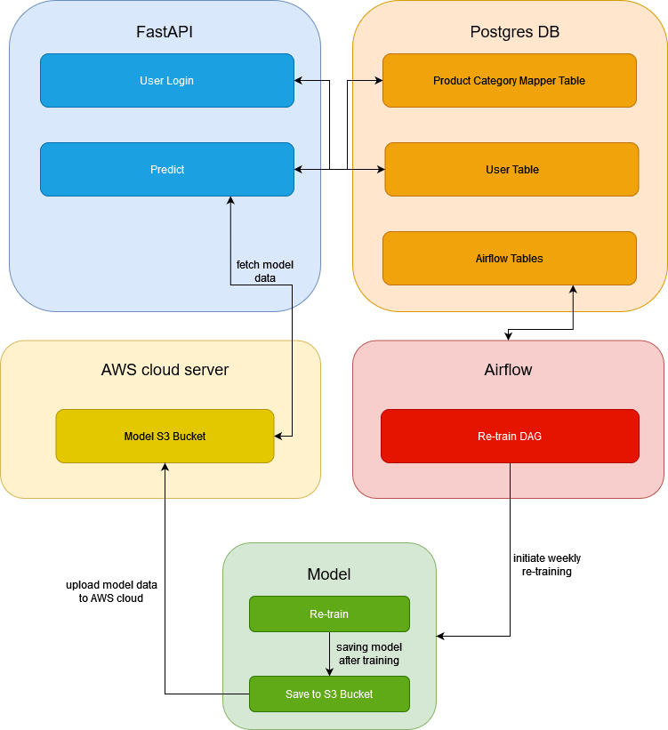

# TODO:
20 Minutes PP
Talk about project
talk about architecture 


GitHub Action Docker Build

~~docker airflow~~
docker Model
docker MLflow

Model:
- store text data in db + img name /url
- store images in E3 Bucket

API: 
- text data db model
- model crud functions
- include model crud into predict endpoint 


Docoumentation 


Rakuten Product Category Classifier
Project Overview
--------------

The purpose of this project is twofold: On the one hand, we created a neural network which is capable of accurately predicting the category (product type) of Rakuten e-commerce products. On the other hand, we implemented a DevOps structure to upkeep and deploy the application.

The model is a deep learning fusion model, i.e. the model handles multi-modal inputs (text and images). These inputs are the product piucture as well as the product description and designation. The text runs through a few LSTM layers, whereas the images are fed into a series of standard CNN blocks. In the end the layers are concatinated for a final prediction. After proper preprocessing and training, this architecture is capable of reaching around 76% accuracy on the data (roughly 84000 products belonging to 27 different classes).

After training, the model and its configuration files are packaged as tar-files and uploaded to an AWS S3 bucket. The API checks the validity of its model data and can update those by downloading the newest model from the S3 bucket. The API then enables the prediction of the category and this API also includes a user database for authentication purposes. Both these features are isolated and deployed in Docker containers. Moreover, we implemented a CI/CD pipeline using GitHub actions. This pipeline runs tests on the code and spins up the Docker containers ensuring their functionality. On top of that we have included an Airflow instance which triggers a re-training of the model on a weekly basis which gets saved in the S3 bucket on the AWS cloud. This re-training is currently happening on the same data that was used for the intial training. Given one's specific needs, one can easily add different DAGs to this Airflow instance.

The implementation scheme can be depicted as follows

# What is in the .github
The GitHub Action include the follwoing 
- flask8
- PyTests
- Docker start up

## Installation and Setup
### Prerequisites
- Docker
- Python 3.11
### .env
The application expects  an .env file in the project root directory.
```.env
# Airflow settings
AIRFLOW_UID=1000
AIRFLOW_GID=0
_PIP_ADDITIONAL_REQUIREMENTS=apache-airflow-providers-docker==2.1.0rc2

# DB Settings
# changeing these values requires adjustments in the docker-compose file and
# backend-app/setup_prdcat_table.py!
POSTGRES_USER=admin 
POSTGRES_PASSWORD=admin 
POSTGRES_DB=rakuten_db

# Model settings
MODEL_FOLDER_METADATA_FILE=model_folder_metadata.csv
FUSION_MODEL=best_fusion_model.keras
MODEL_FOLDER_PATH=app/tmp_data
MODEL_FOLDER_NAME=models
TOKENIZER_CONFIG_FILE_PATH=app/tmp_data/models/tokenizer_config.json
MODEL_FOLDER=models
S3_FILE=models.tar

# AWS settings
# Here specifice credentials and bucket name of own AWS bucket 
AWS_ACCESS_KEY_ID=<-- ADD! 
AWS_SECRET_ACCESS_KEY=<-- ADD!
MODEL_BUCKET=rakuten-models
```
### Model Docker Image
To enable retraining of the Model it is necessary to create the docker image for the model locally.
There for we have to set it up first.
1. Navigate into the model folder
```bash
cd classification_model/
```
2. create and activate a virtual environment 
``` bash
python3.11 -m venv env
#on linux
source env/bin/activate
```
3. Install requirements
``` bash
pip install -r requirements.txt 
```
4. Set up folder structure for data
```
python src/data/import_raw_data.py
```
**Important** only confirm the first question with **yes** the second one with **no**
5. Upload the image data folder set directly on local from https://challengedata.ens.fr/participants/challenges/35/, you should save the folders image_train and image_test respecting the following structure
```
├── data
│   └── raw           
|   |  ├── image_train 
|   |  ├── image_test 
```
6. Then preprocess the data with 
``` bash
python src/data/make_dataset.py data/raw data/preprocessed ```
7. Testing the model code before containerizing
7.1. create a .env file in the classification_model folder
```.env
AWS_ACCESS_KEY_ID= <-- your AWS ACCESS KEY ID 
AWS_SECRET_ACCESS_KEY= <-- your AWS SECRET ACCESS KEY
MODEL_BUCKET=rakuten-models <-- Change if necessary 
MODEL_FOLDER=models
```
7.2. Run the model
```bash
python src/main.py
```
8. Then create the docker image
```bash
docker build . -t rakuten_cf:latest
```

### Run the complete application 
Navigate into the project root directory.
Then set docker host, to enable Airflow to start docker container on the local host
```bash
export DOCKER_HOST=tcp://localhost:2375
```
Initiate Airflow init
```bash
dockerd;compose up airflow-init
```
From now you can start the application with
```bash
docker-compose up
```
Airflow: localhost:8080
FastApi: localhost:8000

Project Organization
------------
    ├── backend-app                # FastAPI application 
    │   ├── app                    # Fast API logic folder
    │   │   ├── api                # API endpoint implementations
    │   │   │   ├── auth.py        # Authentication related code
    │   │   │   ├── image_759577_product_120185380.jpg  # Image file for testing #! WRONG possition 
    │   │   │   ├── __init__.py
    │   │   │   ├── predict_category.py  # Prediction category endpoint
    │   │   │   ├── test_api.py    # API testing module #! WRONG position 
    │   │   │   └── users.py       # User endpoint implementation
    │   │   ├── config             # Configuration files
    │   │   │   ├── config.py      # Configuration settings
    │   │   │   └── __init__.py
    │   │   ├── core               # Core functionality
    │   │   │   ├── __init__.py
    │   │   │   ├── logger.py      # Logging utility
    │   │   │   ├── security.py    # Security-related functions
    │   │   │   └── settings.py    # Application settings
    │   │   ├── __init__.py
    │   │   ├── main.py            # Main application entry point
    │   │   ├── models             # Data models
    │   │   │   ├── database.py    # Database related functions
    │   │   │   ├── __init__.py
    │   │   │   ├── token.py       # Token management functions
    │   │   │   └── user.py        # User data model
    │   │   ├── sql_db             # SQL database module
    │   │   │   ├── crud.py        # CRUD operations for SQL database
    │   │   │   ├── database.py    # Database connection setup
    │   │   │   └── __init__.py
    │   │   └── tf_models          # TensorFlow models
    │   ├── Dockerfile             # Dockerfile for the FastAPI
    │   ├── requirements.txt       # Requirements file for the backend application
    │   ├── setup_prdcat_tabel.py  # Script for setting up product category table
    │   └── tests                  # Test files
    │       ├── api_test           # API test files
    │       ├── __init__.py
    │       └── unit               # Unit test files
    │           ├── __init__.py
    │           └── test_crud.py   # CRUD test module
    ├── docker-compose.yml         # Docker Compose configuration file
    ├── LICENSE                     # License file
    ├── models                      # Models folder (possibly for trained ML models)
    ├── notebooks                   # Notebooks folder (possibly for Jupyter notebooks)
    ├── pgdata                      # PostgreSQL data folder (error opening directory)
    ├── README.md                   # README file
    ├── references                  # References folder
    ├── reports                     # Reports folder
    │   └── figures                 # Figures folder within reports
    ├── requirements.txt            # Top-level requirements file
    └── src                         # Source code folder
        ├── config                  # Configuration files
        ├── data                    # Data processing scripts
        │   ├── __init__.py
        │   └── make_dataset.py     # Script for making datasets
        ├── features                # Feature engineering scripts
        │   ├── build_features.py   # Script for building features
        │   └── __init__.py
        ├── __init__.py
        ├── models                  # Machine learning models
        │   ├── __init__.py
        │   ├── predict_model.py    # Prediction model script
        │   └── train_model.py      # Training model script
        └── visualization           # Visualization scripts
            ├── __init__.py
            └── visualize.py        # Visualization script


Results and Evaluation
---------------
To be filled:
- performance of the model
- ...
0d08c7c9d8fa
